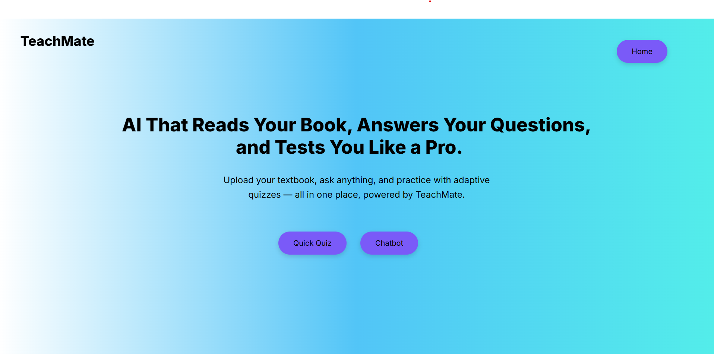

# TeachMate
TeachMate 🧑‍🏫

TeachMate is an AI-driven web application designed to revolutionize personalized learning. It features an intelligent chatbot that uses Retrieval-Augmented Generation (RAG) to deliver real-time, adaptive quizzes. As students progress through tests, the system dynamically adjusts the difficulty based on their performance, leveraging Large Language Models (LLMs) to curate the most appropriate questions.

Features ✨

Adaptive Testing: Questions automatically adjust in difficulty based on user performance, ensuring a tailored learning experience.

AI-Powered Chatbot: The chatbot uses RAG (Retrieval-Augmented Generation) to fetch and generate context-aware responses, enhancing interactivity.

Progress Tracking: Monitors user performance to provide insights and feedback.

User-Friendly Interface: Simple and clean design for ease of use, built with responsiveness in mind.

